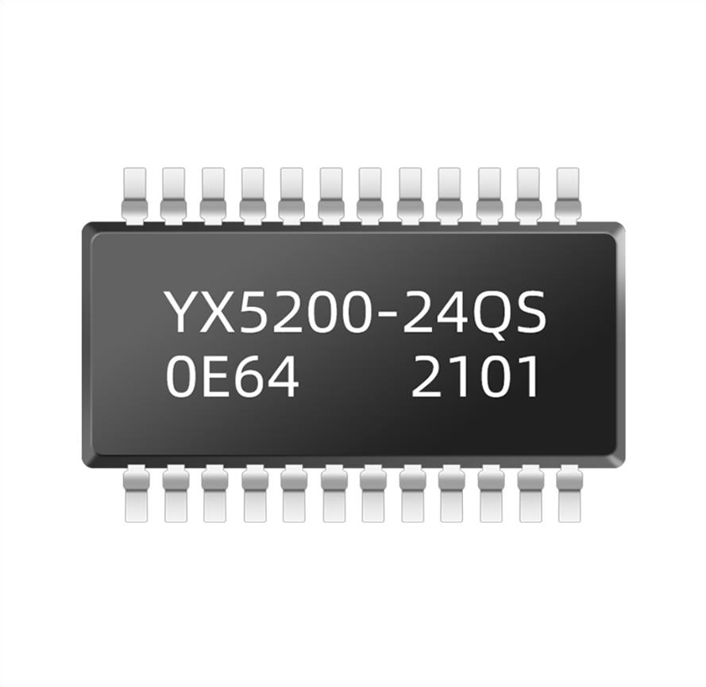
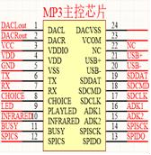
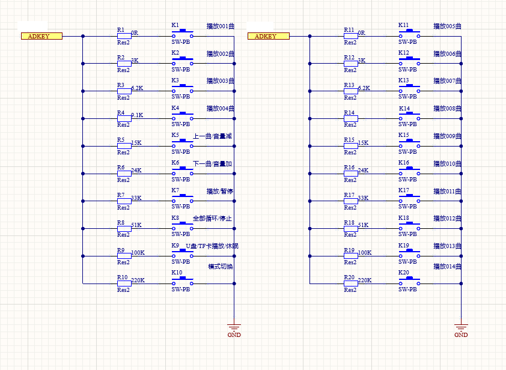
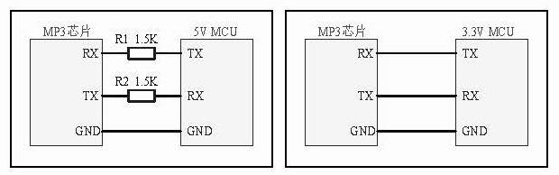
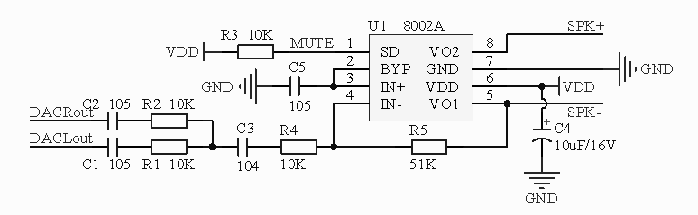
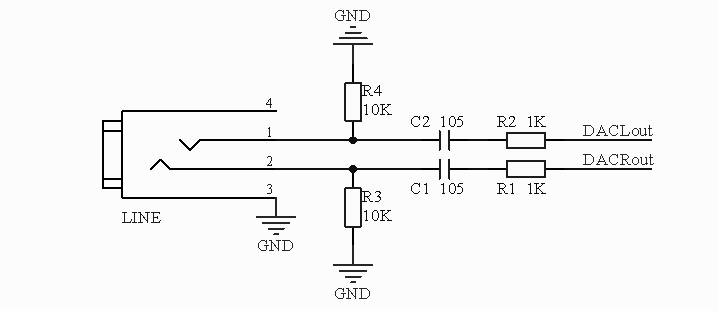
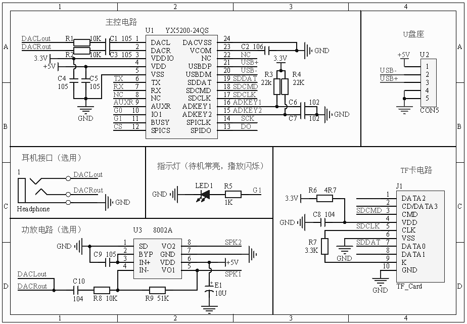
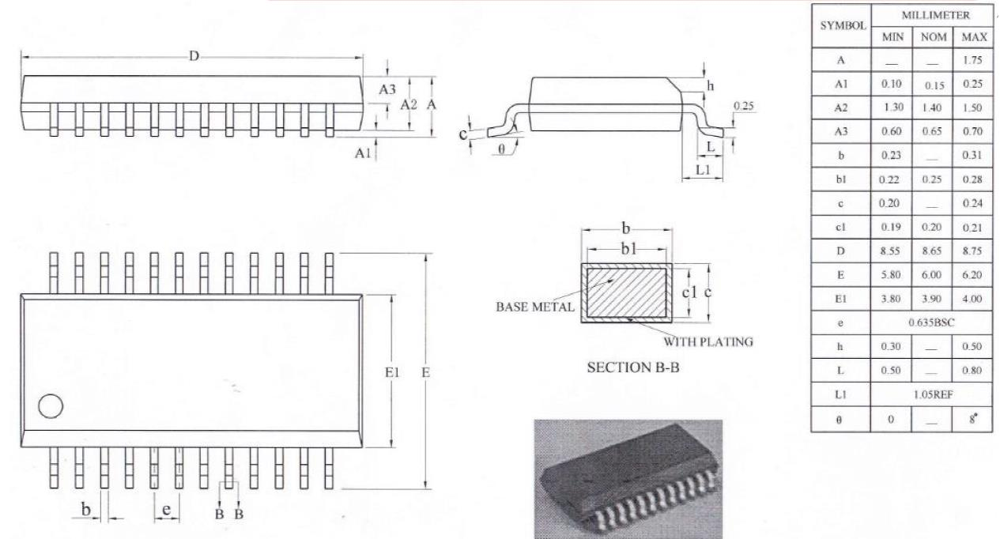

# YX5200-24QS Chip

## Product Manual


---

### Guangzhou Yuexin Electronic Technology Co., Ltd.

Official Website: WWW.YXIN18.COM
Contact Us: 020-36776060 / 18925103846

---

# YX5200-24QS Chip User Manual V1.10

## Table of Contents

* **[1. Overview](#1-overview)**
    + [1.1 Introduction](#11-introduction)
    + [1.2 Features](#12-features)
    + [1.3 Applications](#13-applications)
* **[2. Chip Usage Instructions](#2-chip-usage-instructions)**
    + [2.1 Hardware Parameters](#21-hardware-parameters)
    + [2.2 Pin Description](#22-pin-description)
* **[3. Serial Communication](#3-serial-communication)**
    + [3.1 Communication Format](#31-communication-format)
    + [3.2 Communication Commands](#32-communication-commands)
    + [3.3 Data Returned by the Chip](#33-data-returned-by-the-chip)
        + [3.3.1 Data Returned on Chip Power-Up](#331-data-returned-on-chip-power-up)
        + [3.3.2 Data Returned After Track Playback Completion](#332-data-returned-after-track-playback-completion)
        + [3.3.3 Data Returned for Chip Acknowledgment (ACK)](#333-data-returned-for-chip-acknowledgment-ack)
        + [3.3.4 Data Returned for Chip Errors](#334-data-returned-for-chip-errors)
        + [3.3.5 Device Insertion/Removal Messages](#335-device-insertionremoval-messages)
* **[4. Detailed Serial Command Explanation](#4-detailed-serial-command-explanation)**
    + [4.1 Detailed Explanation of Partial Control Commands](#41-detailed-explanation-of-partial-control-commands)
        + [4.1.1 Play Specified Track Command (0x03)](#411-play-specified-track-command-0x03)
        + [4.1.2 Set Device Volume Command (0x06)](#412-set-device-volume-command-0x06)
        + [4.1.3 Play by Specified Folder and Filename (0x0F)](#413-play-by-specified-folder-and-filename-0x0f)
        + [4.1.4 Play Track from Specified MP3 Folder (0x12)](#414-play-track-from-specified-mp3-folder-0x12)
        + [4.1.5 Single Track Loop Play Command (0x08)](#415-single-track-loop-play-command-0x08)
        + [4.1.6 Specify Playback Device (0x09)](#416-specify-playback-device-0x09)
        + [4.1.7 Play Specified Track in Specified Folder (0x14)](#417-play-specified-track-in-specified-folder-0x14)
        + [4.1.8 Loop All Tracks in Root Directory (0x11)](#418-loop-all-tracks-in-root-directory-0x11)
        + [4.1.9 Start Loop Playback of Specified Folder (0x17)](#419-start-loop-playback-of-specified-folder-0x17)
        + [4.1.10 Random Playback of Device Files (0x18)](#4110-random-playback-of-device-files-0x18)
        + [4.1.11 Set Current Track for Loop Playback (0x19)](#4111-set-current-track-for-loop-playback-0x19)
        + [4.1.12 Insert Advertisement from ADVERT Folder (0x13)](#4112-insert-advertisement-from-advert-folder-0x13)
        + [4.1.13 Multi-Folder Insertion Function (0x25)](#4113-multi-folder-insertion-function-0x25)
    + [4.2 Detailed Explanation of Serial Query Commands](#42-detailed-explanation-of-serial-query-commands)
        + [4.2.1 Query Currently Online Devices (0x3F)](#421-query-currently-online-devices-0x3f)
        + [4.2.2 Playback Status Query Command (0x42)](#422-playback-status-query-command-0x42)
        + [4.2.3 Query Volume (0x43)](#423-query-volume-0x43)
        + [4.2.4 Total File Count (0x47, 0x48)](#424-total-file-count-0x47-0x48)
        + [4.2.5 Current Track (0x4C)](#425-current-track-0x4c)
* **[5. Key Interface](#5-key-interface)**
* **[6. Reference Circuit](#6-reference-circuit)**
    + [6.1 Serial Interface](#61-serial-interface)
    + [6.2 External Mono Amplifier](#62-external-mono-amplifier)
    + [6.3 External Headphone Circuit](#63-external-headphone-circuit)
    + [6.4 Main Control Circuit](#64-main-control-circuit)
* **[7. YX5200-24QS Package Diagram](#7-yx5200-24qs-package-diagram)**
*
    *
*[8. Checksum Calculation Explanation and Checksum Code Porting](#8-checksum-calculation-explanation-and-checksum-code-porting)
**
    + [8.1 Checksum Calculation Explanation](#81-checksum-calculation-explanation)
    + [8.2 Sending End – User's MCU](#82-sending-end--users-mcu)
    + [8.3 Receiving End, Amplifier Board Sending Data to User's MCU](#83-receiving-end-amplifier-board-sending-data-to-users-mcu)
    + [8.4 Serial Command Table](#84-serial-command-table)
    + [8.5 Precautions](#85-precautions)
* **[8.5.1 GPIO Characteristics](#851-gpio-characteristics)**
* **[8.5.2 Application Notes](#852-application-notes)**
* **[9. Serial Operation](#9-serial-operation)**
* **[10. Disclaimer](#10-disclaimer)**
* **[11. Version History](#11-version-history)**

---

# 1. Overview

## 1.1 Introduction

The YX5200-24QS is a compact, high-quality voice chip developed by our company to meet market demands and the pursuit of
high quality. It supports WAV and MP3 audio decoding, offering more flexibility and convenience. It supports TF cards
and U disks as storage media and the FAT file system. It features a USB interface, allowing audio content on the storage
device to be freely replaced via a PC. The software also supports an industrial-grade serial communication protocol,
using TF cards as storage media. It supports 3.3V TTL serial communication. Simple serial commands can be used to play
specified audio and control playback functions without cumbersome low-level operations, making it easy to use.

No programmer or upper computer is needed; sounds can be written directly via USB. It also supports U disks and TF cards
as storage media.

## 1.2 Features

1. Supported sampling rates (kHz): 8/11.025/12/16/22.05/24/32/44.1/48.
2. 24-bit DAC output, dynamic range support up to 90dB, signal-to-noise ratio support up to 85dB.
3. Fully supports FAT16 and FAT32 file systems, supports TF cards up to 32GB, and supports U disks up to 32GB.
4. Multiple control modes available: TTL serial mode, ADK key control mode.
5. Broadcast insertion function, which can pause the currently playing background music. After the broadcast finishes,
   it returns to the background music and continues playback.
6. Audio data is sorted by folders, supporting up to 100 folders, each containing up to 255 tracks.
7. 30-level adjustable volume, 5 EQ options available.

## 1.3 Applications

- In-vehicle navigation voice broadcast
- Mechanical and electrical equipment fault automatic alarm
- Fire voice alarm prompt
- Public security border inspection channel voice prompt
- Vehicle entry/exit channel verification voice prompt
- Electric sightseeing car safe driving voice announcement
- Highway transport inspection, toll station voice prompt
- Power, communication, financial business hall voice prompt
- Railway station, bus station security check voice prompt

---

# 2. Chip Usage Instructions

Our YX5200-24QS chip uses an SOC solution, integrating a 16-bit MCU and a dedicated aDSP for audio decoding. It uses
hardware decoding, ensuring system stability and sound quality. The compact package size better meets the needs of
embedding into other products.

## 2.1 Hardware Parameters

| Name                  | Parameter                                                                                                                                                                                                                                             |
|:----------------------|:------------------------------------------------------------------------------------------------------------------------------------------------------------------------------------------------------------------------------------------------------|
| MP3 File Format       | 1. Supports audio decoding for bitrates up to 192kbps and below (11172-3 and ISO13813-3 layer3) <br> 2. Supported sampling rates (kHz): 8/11.025/12/16/22.05/24/32/44.1/48 <br> 3. Supports sound effects like Normal, Jazz, Classic, Pop, Rock, etc. |
| USB Interface         | 2.0 standard                                                                                                                                                                                                                                          |
| UART Interface        | Standard serial port, TTL level, baud rate 9600                                                                                                                                                                                                       |
| Input Voltage         | 3.3V-5V                                                                                                                                                                                                                                               |
| Rated Current         | 15mA _without U disk_                                                                                                                                                                                                                                 |
| Package Size          | QSOP24 standard                                                                                                                                                                                                                                       |
| Operating Temperature | -40°C ~ 80°C                                                                                                                                                                                                                                          |
| Humidity              | 5% ~ 95%                                                                                                                                                                                                                                              |

---

# 2.2 Pin Description

## MP3 Main Control Chip



### Function Description Remarks

| Pin | Name     | Function                          | Remarks                                                |
|-----|----------|-----------------------------------|--------------------------------------------------------|
| 0   | NC       | No function                       |                                                        |
| 1   | DACL     | Audio Output Left Channel         | Drive headphone, amplifier                             |
| 2   | DACR     | Audio Output Right Channel        | Drive headphone, amplifier                             |
| 3   | VDDIO    | 3.3V Power Output                 | Power for TF card, 24002                               |
| 4   | VDD      | 5V Power Input                    | Do not exceed 5.2V                                     |
| 5   | VSS      | Power Ground                      |                                                        |
| 6   | TX       | UART Serial Data Output           |                                                        |
| 7   | RX       | UART Serial Data Input            |                                                        |
| 8   | CHOICE   | No function                       |                                                        |
| 9   | PLAYLED  | Play Indicator Light              | Output high during playback                            |
| 10  | INFRARED | Infrared Remote Control Reception |                                                        |
| 11  | BUSY     | Busy Output                       | Output high in standby, outputs pulses during playback |
| 12  | SPICS    | SPI_CS Chip Select Bus            |                                                        |
| 13  | SPIDO    | SPI_DO Data Bus                   |                                                        |
| 14  | SPICLK   | SPI_CLK Clock Bus                 |                                                        |
| 15  | ADK2     | ADK2 External Key                 | 22K pull-up                                            |
| 16  | ADK1     | ADK1 External Key                 | 22K pull-up                                            |
| 17  | SDCLK    | SD_CLK Clock Bus                  |                                                        |
| 18  | SDCMD    | SD_CMD Command Bus                |                                                        |
| 19  | SODAT    | SD_DAT Data Bus                   |                                                        |
| 20  | USB-     | USB-DM                            | Connect to USB port of U disk and computer             |
| 21  | USB+     | USB+DP                            | Connect to USB port of U disk and computer             |
| 22  | NC       | No function                       |                                                        |
| 23  | VCOM     | Decoupling                        |                                                        |
| 24  | DACVSS   | Audio Ground                      |                                                        |

---

# 3. Serial Communication

As a commonly used communication method in the control field, we have industrially optimized the serial port by adding
frame checksums, retransmission, error handling, and other measures, greatly enhancing communication stability and
reliability. It can also be extended to more powerful RS485 for networking functions. The serial communication baud rate
can be set by the user, default is 9600.

## 3.1 Communication Format

Supports asynchronous serial communication mode, receiving commands from the host computer via the serial port.

Communication standard: 9600 bps
Data bits: 8
Parity bit: none
Flow control: none

Format: ```$S VER Len CMD dat checksum $O```

| Name     | Function                      | Description                                              |
|:---------|:------------------------------|----------------------------------------------------------|
| $S       | Start bit. 0x7E               | Each command/feedback starts with $, i.e., 0x7E          |
| VER      | Address code                  | Device address, default FF                               |
| Len      | Byte length                   | Excluding checksum                                       |
| CMD      | Operation code                | Represents specific operations, such as play/pause, etc. |
| Feedback | Feedback                      | Used to control whether feedback information is needed   |
| dat      | Parameter                     | Associated with the previous len, unlimited length       |
| checksum | Checksum _occupies two bytes_ | Sum checksum _starting bit $ not counted_                |
| $0       | End bit                       | End bit 0xEF                                             |

## 3.2 Communication Commands

1. Control Commands

| CMD Command (Control) | Corresponding Function                    | Parameter (16-bit)                         |
|:----------------------|:------------------------------------------|:-------------------------------------------|
| 0x01                  | Next track                                |                                            |
| 0x02                  | Previous track                            |                                            |
| 0x03                  | Specify track (NUM)                       | 1-2999                                     |
| 0x04                  | Volume +                                  |                                            |
| 0x05                  | Volume -                                  |                                            |
| 0x06                  | Specify volume                            | 0-30                                       |
| 0x07                  | Specify EQ 0/1/2/3/4/5                    | Normal/Pop/Rock/Jazz/Classic/Bass          |
| 0x08                  | Single track loop play specified track    | 1-2999                                     |
| 0x09                  | Specify playback device 1/2               | U disk/SD card                             |
| 0x0C                  | Chip reset                                |                                            |
| 0x0D                  | Play                                      |                                            |
| 0x0E                  | Pause                                     |                                            |
| 0x0F                  | Play specified folder                     | 1-10 (needs to be set by user)             |
| 0x10                  | Loudspeaker settings (none)               | [DH=1: Loudspeaker on] [DL: Set gain 0-31] |
| 0x11                  | Loop all playback                         | [1: Loop play] [0: Stop loop play]         |
| 0x12                  | Specify MP3 folder track                  | 0—3000                                     |
| 0x13                  | Insert advertisement                      | 0—3000                                     |
| 0x14                  | Play specified track in specified folder  | Supports 16 folders                        |
| 0x15                  | Stop insertion, play background           |                                            |
| 0x16                  | Stop playback                             |                                            |
| 0x17                  | Loop play specified folder                | See detailed explanation below             |
| 0x18                  | Random play specified folder              |                                            |
| 0x19                  | Set currently playing track for loop play |                                            |
| 0x1A                  | Set DAC                                   | See detailed explanation below             |

2. Query Commands

| CMD Command (Query) | Corresponding Function               | Parameter (16-bit)                                   |
|:--------------------|:-------------------------------------|:-----------------------------------------------------|
| 0x3F                | Query online devices                 | 0 - 0x0F (lower 4 bits each represent a device)      |
| 0x40                | Return error, request retransmission |                                                      |
| 0x41                | Acknowledge (ACK)                    |                                                      |
| 0x42                | Query current status                 |                                                      |
| 0x43                | Query current volume                 |                                                      |
| 0x44                | Query current EQ                     |                                                      |
| 0x45                | Query current playback mode          | This function is reserved in this version            |
| 0x46                | Query current software version       | This function is reserved in this version            |
| 0x47                | Query UDISK total file count         | Total number of files inside U disk [MP3/WAV files]  |
| 0x48                | Query TF card total file count       | Total number of files inside TF card [MP3/WAV files] |
| 0x4B                | Query UDISK current track            | Physical order                                       |
| 0x4C                | Query TF card current track          | Physical order                                       |

## 3.3 Data Returned by the Chip

The chip returns data at key points for the user to monitor the chip's working status.

- Data upon successful chip power-up initialization.
- Data after the chip finishes playing the current track.
- ACK (acknowledgment) returned by the chip upon successfully receiving a command.
- Error returned when the chip receives a frame of data incorrectly _including incomplete data reception and checksum
  error_.
- The chip returns a busy command when data is received while it is busy.
- Data is returned upon U disk/TF card insertion/removal.

---

### 3.3.1 Data Returned on Chip Power-Up

1) The chip requires a certain initialization time upon power-up, determined by the number of files on devices like U
   disks and TF cards. Generally, this time is between 1.5s to 3s. If the chip's initialization data hasn't been sent
   out beyond this time, it indicates an initialization error. Please reset the chip's power and check the hardware
   connections.

2) Chip initialization data includes online devices. For example, sending `7E FF 06 3F 00 00 01 xx xx EF` where
   `DL = 0x01` indicates that only the U disk is online during power-up. Other data please refer to the table below. The
   devices are in an OR relationship.

| Event             | Event code example            |
|-------------------|-------------------------------|
| U Disk Online     | 7E FF 06 3F 00 00 01 xx xx EF |
| TF Online         | 7E FF 06 3F 00 00 02 xx xx EF |
| U Disk, TF Online | 7E FF 06 3F 00 00 03 xx xx EF |
| PC Online         | 7E FF 06 3F 00 00 04 xx xx EF |

The devices are in an OR relationship.

3) The MCU must wait for the chip initialization command to be issued before sending corresponding control commands.
   Otherwise, commands will not be processed by the chip and may also affect the normal initialization of the chip.

### 3.3.2 Data Returned After Track Playback Completion

| Event                            | Event code example            |
|----------------------------------|-------------------------------|
| U Disk Finished Playing Track 1  | 7E FF 06 3C 00 00 01 xx xx EF | 
| U Disk Finished Playing Track 2  | 7E FF 06 3C 00 00 02 xx xx EF | 
| TF Card Finished Playing Track 1 | 7E FF 06 3D 00 00 01 xx xx EF | 
| TF Card Finished Playing Track 2 | 7E FF 06 3D 00 00 02 xx xx EF | 

1. For many trigger-type playback requirements, our chip has been corrected to automatically enter the stop state after
   playing one track. If users need this type of application, they only need to specify the track to play. This way, the
   track will automatically stop after playback, waiting for instructions.

2. Additionally, we have dedicated an IO pin to indicate the decoding and stop status. Please refer to pin 11, the BUSY
   pin.
    1) Playback status outputs low level [many amplifiers have a mute pin, which can be controlled directly by this IO].
    2) Playback pause status outputs high level. Chip sleep status also outputs high level.

3. For continuous playback applications, it can be implemented as follows. If the TF card finishes playing the first
   song, it will return `7E FF 06 3D 00 01 xx xx EF`
   `3D` —— indicates the TF card command
   `00 01` —— indicates the finished track.

4. After the chip is powered on and initializes normally, it will automatically enter the device playback state and stop
   decoding, waiting for the user to send playback-related commands.

5. Additionally, after the user specifies a device, they need to wait 200ms before sending the specified track command.
   This is because once the device is specified, the system initializes the file system for the specified device.
   Sending the specified track command immediately may cause the chip to not receive it.

---

### 3.3.3 Data Returned for Chip Acknowledgment (ACK)

| Event                           | Event code example            |
|---------------------------------|-------------------------------|
| U Disk Finished Playing Track 1 | 7E FF 06 3C 00 00 01 xx xx EF |

1) To enhance the stability of data communication, we have added acknowledgment processing. The ACK byte sets whether a
   reply is needed. The benefit is that it ensures a handshake signal for each communication. Receiving an ACK indicates
   that the data sent by the MCU has been successfully received by the chip and will be processed immediately.
2) For general applications, customers can freely choose; omitting this acknowledgment processing is also acceptable.

### 3.3.4 Data Returned for Chip Errors

| Event                          | Event code example                | Remarks                                        |
|--------------------------------|-----------------------------------|------------------------------------------------|
| Return Busy                    | 7E FF 06 40 00 00 **01** xx xx EF | Chip is initializing file system               |
| Currently in Sleep Mode        | 7E FF 06 40 00 00 **02** xx xx EF | Sleep mode only supports specifying device     |
| Serial Port Receive Error      | 7E FF 06 40 00 00 **03** xx xx EF | Serial port finished receiving a frame of data |
| Checksum Error                 | 7E FF 06 40 00 00 **04** xx xx EF | Sum checksum error                             |
| Specified File Out of Range    | 7E FF 06 40 00 00 **05** xx xx EF | File specification exceeds set range           |
| Specified File Not Found       | 7E FF 06 40 00 00 **06** xx xx EF | Specified file was not found                   |
| Insert Command Error           | 7E FF 06 40 00 00 **07** xx xx EF | Current state does not accept insertion        |
| Data Does Not Conform to Rules | 7E FF 06 40 00 00 **08** xx xx EF | e.g., sent 0 where minimum is 1                |

1) To enhance the stability of data communication, we have added a data error handling mechanism. The chip will provide
   feedback when receiving data that does not conform to the format.
2) In harsh environments, it is strongly recommended that customers handle this command. If the application environment
   is general, it can be ignored.
3) The chip returning busy basically only happens during chip power-up initialization because the chip needs to
   initialize the file system.
4) After power-up, the chip enters the device state. The device order is U disk — TF card. If both the U disk and TF
   card are offline, the chip will enter sleep mode.
5) As long as you refer to our provided test SDK program and port the serial operation part, checksum errors will not
   occur. We strongly recommend users use our provided checksum method. Because no one can guarantee that data
   transmission will not出错 (go wrong).
6) For errors in the file specification part, please refer to the "Specify Filename Playback Detailed Explanation"
   below.

### 3.3.5 Device Insertion/Removal Messages

| Event           | Event code example            |
|-----------------|-------------------------------|
| U Disk Inserted | 7E FF 06 3A 00 00 01 xx xx EF |
| TF Inserted     | 7E FF 06 3A 00 00 02 xx xx EF |
| PC Inserted     | 7E FF 06 3A 00 00 04 xx xx EF |
| U Disk Removed  | 7E FF 06 3B 00 00 01 xx xx EF |
| TF Removed      | 7E FF 06 3B 00 00 02 xx xx EF |
| PC Removed      | 7E FF 06 3B 00 00 04 xx xx EF |

1) To enhance the flexibility of the chip, we have specifically added command feedback for device insertion and removal.
   This方便 (facilitates) users knowing the working status of the chip.
2) When a device is inserted, we默认 (default) enter the device waiting state. If the user inserts a U disk with an
   indicator light, they can see the U disk light flashing and also receive the device insertion serial message.

# 4. Detailed Serial Command Explanation

Below we provide detailed explanations for some commonly used commands.

Note: The command format is: Start bit + Address code + Byte length + Operation code + Feedback + Parameter + Checksum +
End bit

`7E FF 06 01 00 DH DL CRC_L CRC_H EF`

CRC_L, CRC_H are the data checksum codes. In the following commands, DH, DL are input values, corresponding numerical
values should be input by the user according to actual requirements; Note that command values are all in hexadecimal;

## 4.1 Detailed Explanation of Partial Control Commands

### 4.1.1 Play Specified Track Command (0x03)

The instruction we provide supports specifying a track for playback. The track selection range is 1~2999. It can
actually support more, but due to file management reasons, supporting too many tracks will slow down system operations,
and general applications do not require supporting so many files. This command is specified according to the physical
storage order. The TF card defaults to the root directory.

1) For track selection, if selecting the 100th track, first convert 100 to hexadecimal (two bytes), which is `0x0064`.
   `DH = 0x00`; `DL = 0x64`;
2) If selecting the 1000th track for playback, first convert 1000 to hexadecimal (two bytes), which is `0x03E8`
   `DH = 0x03`; `DL = 0xE8`;
3) Other operations can be deduced by analogy, as using hexadecimal is the most convenient operation in the embedded
   field.

Command: `7E FF 06 03 00 DH DL CRC_L CRC_H EF` DH DL represents the track sequence parameter to be played

Example:
Send: `7E FF 06 03 00 00 01 FE F7 EF` Specify playback of the first track in the root directory `DH = 0x00` ;
`DL = 0x01`
Receive: `7E FF 06 3E 00 00 01 FE BC EF` First track playback finished

Reference commands:

| Command (xx xx represents checksum) | Description                                      |
|:------------------------------------|:-------------------------------------------------|
| 7E FF 06 03 00 **00 01** xx xx EF   | Specify playback of physical sequence track 1    |
| 7E FF 06 03 00 **00 1E** xx xx EF   | Specify playback of physical sequence track 99   |
| 7E FF 06 03 00 **0B B8** xx xx EF   | Specify playback of physical sequence track 3000 |

---

### 4.1.2 Set Device Volume Command (0x06)

1) The default volume of our amplifier board is 30, with 30 volume levels. To set the volume, send the corresponding
   command;
2) There is no return data for successful volume setting;
3) The volume set by the command will be reset when the device restarts. If power-off memory is required, the volume can
   be set via a configuration file;

Command: `7E FF 06 06 00 DH DL CRC_L CRC_H EF` DL is the parameter for the volume to be set. Convert the desired volume
to a hexadecimal number and input it into the DL position;
Example:
Send: `7E FF 06 06 00 00 1E FE D7 EF` Set the current volume of the amplifier board to 30. 30 converted to hexadecimal
is `DH=0x1E`, `DL=0x1E`;

Reference commands:

| Command (xx xx represents checksum) | Description                           |
|:------------------------------------|:--------------------------------------|
| 7E FF 06 06 00 00 00 xx xx EF       | Set current device volume to 0 (mute) |
| 7E FF 06 06 00 00 19 xx xx EF       | Set current device volume to 25       |

### 4.1.3 Play by Specified Folder and Filename (0x0F)

Command: `7E FF 06 0F 00 DH DL CRC_L CRC_H EF`

DH: Represents the folder name, default supports 99 files, i.e., 01 ~ 99 (named 01 ~ 99); `DH=0x01 ~ 0x63`;
DL: Represents the track, default maximum 255 songs, i.e., 001~255; `DL=0x01 ~ 0xFF`

Example:

+ Send: `7E FF 06 0F 00 01 01 FE EA EF` Specify playback of a file "001xxx.MP3" in folder "01" DH=0x01, DL=0x01;
+ Receive: `7E FF 06 3E 00 00 01 FE BC EF` Track playback finished, the returned data may vary slightly depending on the
  naming;

1) Specified folder playback is our extended function. The default folder naming format is: "01"…"99". The track naming
   format inside the folder is: "001xxx.mp3"…"255xxx.mp3". Each folder supports a maximum of 255 songs, supporting up to
   99 folders;
2) Both the folder and filename must be specified simultaneously; Specifying folder and track supports both MP3 and WAV
   formats;
3) The following two screenshots illustrate the specification of the folder and filename [as shown in the figure].
   Please strictly follow our instructions for naming folders and filenames;

Parameter commands:

| Command (xx xx represents checksum) | Description                  |
|:------------------------------------|:-----------------------------|
| 7E FF 06 **0F** 00 01 01 xx xx EF   | Play 001xxx.mp3 in folder 01 |
| 7E FF 06 **0F** 00 01 63 xx xx EF   | Play 099xxx.mp3 in folder 01 |
| 7E FF 06 **0F** 00 02 63 xx xx EF   | Play 099xxx.mp3 in folder 02 |
| 7E FF 06 **0F** 00 08 64 xx xx EF   | Play 100xxx.mp3 in folder 11 |
| 7E FF 06 **0F** 00 63 FF xx xx EF   | Play 255xxx.mp3 in folder 99 |

### 4.1.4 Play Track from Specified MP3 Folder (0x12)

1) Based on specifying folder and filename, we extended the functionality for a single folder. The folder must be
   named "MP3".
2) Supports up to 65536 tracks, but considering file system operation speed, track switching speed may slow down
   accordingly as files increase, so it is temporarily set to 3000 segments.
3) The specified file naming is as follows:

0001Rollback.wav
0002Unbalance.wav
0255Simple.wav
1999Secret.wav
3000Disabled.wav

Reference commands:

| Command (xx xx represents checksum) | Description                |
|:------------------------------------|:---------------------------|
| 7E FF 06 12 00 00 01 xx xx EF       | "MP3" folder, track "0001" |
| 7E FF 06 12 00 00 02 xx xx EF       | "MP3" folder, track "0002" |
| 7E FF 06 12 00 00 FF xx xx EF       | "MP3" folder, track "0255" |
| 7E FF 06 12 00 07 CF xx xx EF       | "MP3" folder, track "1999" |
| 7E FF 06 12 00 0B B8 xx xx EF       | "MP3" folder, track "3000" |

### 4.1.5 Single Track Loop Play Command (0x08)

Command: `7E FF 06 08 00 00 DL CRC_L CRC_H EF` DL represents the track to loop play

1) For requirements needing single track loop playback, we improved this control command 0x08. When operating the TF
   card or U disk, it is specified according to the physical storage order of the files, please note this.
2) During loop playback, operations like play/pause, previous track, next track, volume adjustment, including EQ, etc.,
   can be performed normally, and the state remains loop playback. The loop playback state can be closed by specifying a
   single track trigger play or stop.

Reference commands:

| Command (xx xx represents checksum) | Description                                      |
|:------------------------------------|:-------------------------------------------------|
| 7E FF 06 08 00 00 01 xx xx EF       | Loop play the first track in the root directory  |
| 7E FF 06 08 00 00 02 xx xx EF       | Loop play the second track in the root directory |
| 7E FF 06 08 00 00 03 xx xx EF       | Loop play the third track in the root directory  |

### 4.1.6 Specify Playback Device (0x09)

Command: `7E FF 06 09 00 00 DL CRC_L CRC_H EF` DL=0x01 for U disk playback, DL=0x02 for TF card playback;

1) Our module supports 2 types of playback devices by default. Only online devices can be specified for playback.
   Whether the device is online is automatically detected by our software; users do not need to worry about it.
2) After specifying the device, the module automatically enters the stop decoding state, waiting for the user to specify
   a track for playback. From receiving the specified device to the module internally completing file system
   initialization, it takes about 200ms. Please wait 200ms before sending the specified track command.
3) If you need to specify a specific device for playback, you can send the command to specify the playback device;

Reference commands:

| Command (xx xx represents checksum) | Description                       |
|:------------------------------------|:----------------------------------|
| 7E FF 06 09 00 00 01 xx xx EF       | Specify playback device - U disk  |
| 7E FF 06 09 00 00 02 xx xx EF       | Specify playback device - TF card |

### 4.1.7 Play Specified Track in Specified Folder (0x14)

In response to many customer requirements for 16 folders, each managing 3000 tracks, we specially added this command for
users to call. The detailed explanation is as follows:

1) The serial command byte is 0x14
2) The parameter is two bytes. Suppose specifying folder "12", track "1999"
   Serial data: `7E FF 06 14 00 C7 CF FD 51 EF`
   Among them, `0xC7` and `0xCF` are parameters, combined is `0xC7CF`. Total 16 bits.
   The high 4 bits represent the folder name, here `C` represents 12.
   The low 12 bits represent the filename, here `7CF` represents 1999, which is the track with the prefix "1999".
3) Folder naming is as follows:

+ 01
+ 12
+ 02
+ 03

Reference commands:

| Command (xx xx represents checksum) | Description                       |
|:------------------------------------|:----------------------------------|
| 7E FF 06 14 00 10 FF xx xx EF       | Specify folder "01", track "0255" |
| 7E FF 06 14 00 17 CF xx xx EF       | Specify folder "01", track "1999" |
| 7E FF 06 14 00 C0 01 xx xx EF       | Specify folder "12", track "0001" |
| 7E FF 06 14 00 C0 FF xx xx EF       | Specify folder "12", track "0255" |
| 7E FF 06 14 00 C7 CF xx xx EF       | Specify folder "12", track "1999" |

---

### 4.1.8 Loop All Tracks in Root Directory (0x11)

| Command  (xx xx represents checksum) | Action   |
|--------------------------------------|----------|
| 7E FF 06 11 00 00 01 xx xx EF        | Loop On  |
| 7E FF 06 11 00 00 00 xx xx EF        | Loop Off |

1) This command plays all voice files stored in the device sequentially and loops playback, regardless of whether the
   device contains folders. And the first voice file played must be the first voice file in the device.
2) After loop playback, the `next track` is also sequential, the `previous track` is also sequential, even `pausing` and
   `resuming` playback is sequential. It can only be changed by switching the state. Without changing the state, it is
   looping.

### 4.1.9 Start Loop Playback of Specified Folder (0x17)

Command: `7E FF 06 17 00 DH DL CRC_L CRC_H EF`

Example:

| Direction | Command (xx xx represents checksum) | Description                            |
|:----------|:------------------------------------|:---------------------------------------|
| Send      | 7E FF 06 17 00 00 01 FE E3 EF       | Loop play folder 01, DH=0x00, DL=0x01; |
| Receive   | 7E FF 06 3E 00 00 01 FE BC EF       | Folder 01 track 01 playback finished   |
| Receive   | 7E FF 06 3E 00 00 02 FE BB EF       | Folder 01 track 02 playback finished   |

DL: Represents the folder name, default supports 99 folders, i.e., 01 ~ 99 (named 01 ~ 99); DH=0x01~0x63; (Note: Text
says DL for folder but example uses DH=0x00, DL=0x01. Likely DH should be 0x00 for root or specific meaning, DL is
folder number. Assuming DL is folder number based on example and text "DL:FolderName").

1) The folder naming must be "01" to "99", cannot exceed 99; naming method refers to section 4.1.3;
2) Once the specified folder loop is started, commands like play/pause/previous track/next track can be used. These
   operation commands will not interrupt the current folder loop playback state. That is, after sending the next track
   command, it will still loop the current folder.
3) Users can send a stop command to end loop playback and return to the trigger playback state.
4) Loop playback returns one data packet after each track finishes playing, corresponding to the track that just
   finished playing;

Reference commands:

| Command (xx xx represents checksum) | Description         |
|:------------------------------------|:--------------------|
| 7E FF 06 17 00 00 01 xx xx EF       | Loop play folder 01 |
| 7E FF 06 17 00 00 02 xx xx EF       | Loop play folder 02 |
| 7E FF 06 17 00 00 0A xx xx EF       | Loop play folder 10 | 
| 7E FF 06 17 00 00 63 xx xx EF       | Loop play folder 99 |

---

### 4.1.10 Random Playback of Device Files (0x18)

| Command         | Command code example              | Remarks                              |
|-----------------|-----------------------------------|--------------------------------------|
| Random Playback | 7E FF 06 **18** 00 00 00 xx xx EF | Random playback of the entire device |

1) This command randomly plays all voice files stored in the device, according to physical order, regardless of whether
   the device contains folders. And the first voice file played must be the first voice file in the device.
2) After random playback, the next track is also random, the previous track is also random, even pausing and resuming
   playback is random. It can only be changed by switching the state. Whether it is random playback or specified folder
   loop playback, without giving a single track loop playback command, whether it is previous track or next track, it
   will not exit this state, unless power is cycled.

### 4.1.11 Set Current Track for Loop Playback (0x19)

Command: `7E FF 06 19 00 DH DL CRC_L CRC_H EF` DL=0x00, loop playback on; DL=0x01, loop playback off;

Example: Send: `7E FF 06 19 00 00 00 FE E2 EF` Loop on, DL=0x00; (*Assuming DH is unused or 00*)
Send: `7E FF 06 19 00 00 01 FE E1 EF` Loop off, DL=0x01;

1) Sending this command during playback will loop the current track. If currently in pause or stop state, the device
   will not respond to this command.
2) To turn off single track loop playback, send the off command. This will stop after the current track finishes
   playing.

### 4.1.12 Insert Advertisement from ADVERT Folder (0x13)

1) We support inserting other tracks for playback during track selection playback, thus meeting the need to insert
   advertisements during background music playback.
2) After sending the 0x13 command, the system will save the ID3 information of the currently playing track, then play
   the specified insertion track. After the insertion track finishes playing, the system will return to the saved
   playback breakpoint and continue playback until finished.
3) The setup format is: create a folder named "ADVERT" in the device, and store the tracks to be inserted inside. The
   tracks should be set as "0xxx+trackname.MP3/WAV".
4) Additionally, if the system is currently in pause or stop state, sending the insertion command will not get a
   response, and an error message will be returned. If during insertion, other tracks can be inserted继续插播 (continue
   to be inserted), but after playback finishes, it will still return to the first saved ID3 information point.
5) Specify insertion advertisement settings as follows:

## Reference commands:

| Command (xx xx represents checksum) | Description                   |
|:------------------------------------|:------------------------------|
| 7E FF 06 13 00 00 01 xx xx EF       | "ADVERT" folder, track "0001" |
| 7E FF 06 13 00 00 02 xx xx EF       | "ADVERT" folder, track "0002" |
| 7E FF 06 13 00 00 FF xx xx EF       | "ADVERT" folder, track "0255" |

### 4.1.13 Multi-Folder Insertion Function (0x25)

**Command:** `7E FF 06 25 00 DH DL CRC_L CRC_H EF` DH represents the "ADVERT" folder number, DL represents the track
within the folder;

**Example:** Send: `7E FF 06 25 00 01 01 FE D4 EF` Insert track "001.MP3" from folder "ADVERT1";

1) We support inserting other tracks for playback during track selection playback, thus meeting the need to insert
   advertisements during background music playback; After sending the 0x25 command, the system will save the ID3
   information of the currently playing track, then play the specified insertion track; After the insertion track
   finishes playing, the system will return to the saved playback breakpoint and continue playback until finished;
2) The insertion command will only take effect if currently playing audio. If no audio is currently playing, sending the
   insertion command will return data: `7E FF 06 40 00 00 07 xx xx EF`; indicating the current state does not accept
   insertion; (*Note: Text says 07 error code for insert command error*)
3) Up to 9 folders are supported, i.e., from ADVERT1 to ADVERT9. The folder names must strictly follow our rules,
   otherwise errors will occur; The maximum number of files in a single insertion folder cannot exceed 255, i.e., up
   to "255xxx.MP3". Please note the filename naming format as shown in the figure. 
4) If the currently playing folder is in a single track loop or current folder loop, even if AD inserted, it will not
   change the current state; it will still be single track loop or folder loop playback, unless the user uses the stop
   command or other methods.
5) This insertion function supports TF cards and U disks. Insertion files are only allowed within the same device.

Reference commands:

| Command (xx xx represents checksum) | Description                   |
|:------------------------------------|:------------------------------|
| 7E FF 06 25 00 01 01 xx xx EF       | Folder "ADVERT1", track "001" |
| 7E FF 06 25 00 01 02 xx xx EF       | Folder "ADVERT1", track "002" |
| 7E FF 06 25 00 02 01 xx xx EF       | Folder "ADVERT2", track "001" |

## 4.2 Detailed Explanation of Serial Query Commands

Below we provide detailed explanations for key points regarding query commands:

### 4.2.1 Query Currently Online Devices (0x3F)

Send command: `7E FF 06 3F 00 00 00 xx xx EF` Query online devices, CMD=0x3F;

Return receive: `7E FF 06 3F 00 00 01 xx xx EF` DL=0x01, indicates U disk online
Return receive: `7E FF 06 3F 00 00 02 xx xx EF` DL=0x02, indicates TF card online
Return receive: `7E FF 06 3F 00 00 03 xx xx EF` DL=0x03, indicates both U disk and TF card online

The chip continuously detects the device's online status during operation. Users can query it using the 0x3F command;

### 4.2.2 Playback Status Query Command (0x42)

Send command: `7E FF 06 42 00 00 00 FE B9 EF` Query the amplifier board's current playback status, CMD=0x42

Return data: `7E FF 06 42 00 DH DL CRC_L CRC_H EF`
Return receive: `7E FF 06 42 00 02 00 FE B7 EF` DH=0x02, DL=0x00, indicates TF card stop playback status

| Value of DH in Return Data | Description      | Value of DL in Return Data | Corresponding Amplifier Board Status              |
|:---------------------------|:-----------------|:---------------------------|:--------------------------------------------------|
| 0X01                       | U Disk Playback  | 0x00                       | Amplifier board currently in stop playback state  |
| 0X02                       | TF Card Playback | 0x01                       | Amplifier board currently in play state           |
|                            |                  | 0x02                       | Amplifier board currently in pause playback state |

1) The control module has 3 states open to users during decoding. Users can query to obtain the module's current status.
2) Playback pause means a track is being played and was manually paused by command. Playback stop means a track has
   finished playing, and the module is in the stop playback state.

### 4.2.3 Query Volume (0x43)

Send command: `7E FF 06 43 00 00 00 FE B8 EF` Query the amplifier board's current volume, CMD=0x43;
Return receive: `7E FF 06 43 00 00 1E FE 9A EF` Current volume is level 30, DL=0x1E;

The DL bit in the return data is the current volume value of the amplifier board. Convert its hexadecimal number to
decimal to get the current volume. For example, 0x1E converted to decimal is 30, indicating the current volume is 30.

### 4.2.4 Total File Count (0x47, 0x48)

Send command: `7E FF 06 47 00 00 00 xx xx EF` Query the total number of files on the U disk of the amplifier board;
Return receive: `7E FF 06 47 00 00 07 FE AB EF` DH=0x00, DL=0x07, total number of files on the U disk is 7

Send command: `7E FF 06 48 00 00 00 xx xx EF` Query the total number of files on the TF card of the amplifier board;
Return receive: `7E FF 06 48 00 00 08 FE AB EF` DH=0x00, DL=0x08, total number of files on the TF card is 8;

The DH, DL bits in the return data represent the total file count. Convert their hexadecimal number to decimal to get
the current total file count of the amplifier board. For example, DH=0x00, DL=0x07 converted to decimal is 07,
indicating the current total file count is 7. Generally, we don't store that many files, so looking at the DL value is
sufficient;

---

### 4.2.5 Current Track (0x4C)

Send command: `7E FF 06 4C 00 00 00 FE AF EF` Query TF card current track;
Return receive: `7E FF 06 4C 00 00 01 FE AE EF` Currently playing or finished playing is physical sequence track 1;

The DH, DL bits in the return data are the track currently playing or just finished playing on the amplifier board.
Convert their hexadecimal number to decimal to get the current playing track (physical sequence). For example, DH=0x00,
DL=0x02 converted to decimal is 02, indicating the current track is the second track in physical sequence. Generally, we
don't store that many files, so looking at the DL value is sufficient;

## 5. Key Interface

The chip uses the Analog to Digital Key (ADKey) method, replacing the traditional matrix keyboard connection. The
advantage is that it fully uses the increasingly powerful AD function of MCUs. The design is simple but not simplistic.
Our chi default configuration has 2 AD ports, with resistance for 20 keys. If used in with strong electromagnetic
interference or strong inductive/capacitive loads, please refer to our "Precautions".

1) Reference schematic diagram: 

# Series Resistor Value Corresponding Function Table:

| Interface            | Series Resistor | Key | Short Press                 | Long Press        | Remarks                                  |
|:---------------------|:----------------|:----|:----------------------------|:------------------|:-----------------------------------------|
|                      | OR              | K1  | Play root directory 001.MP3 | Loop play 001.MP3 | Short press plays once, long press loops |
|                      | 3K              | K2  | Play root directory 002.MP3 | Loop play 002.MP3 |                                          |
|                      | 6.2K            | K3  | Play root directory 003.MP3 | Loop play 003.MP3 |                                          |
| ADKEY1 (Chip Pin 16) | 9.1K            | K4  | Play root directory 004.MP3 | Loop play 004.MP3 |                                          |
|                      | 15K             | K5  | Next Track                  | Volume Up         |                                          |
|                      | 24K             | K6  | Previous Track              | Volume Down       |                                          |
|                      | 33K             | K7  | Play/Pause                  |                   |                                          |
|                      | 51K             | K8  | All Loop                    |                   |                                          |
|                      | 100K            | K9  | U Disk/TF Card Play/Sleep   |                   |                                          |
|                      | 220K            | K10 | Play Mode                   |                   | Can interrupt/Cannot interrupt           |
| ADKEY2 (Chip Pin 15) | OR              | K11 | Play root directory 005.MP3 | Loop play 005.MP3 | Short press plays once, long press loops |
|                      | 3K              | K12 | Play root directory 006.MP3 | Loop play 006.MP3 |                                          |
|                      | 6.2K            | K13 | Play root directory 007.MP3 | Loop play 007.MP3 |                                          |
|                      | 9.1K            | K14 | Play root directory 008.MP3 | Loop play 008.MP3 |                                          |
|                      | 15K             | K15 | Play root directory 009.MP3 | Loop play 009.MP3 |                                          |
|                      | 24K             | K16 | Play root directory 010.MP3 | Loop play 010.MP3 |                                          |
|                      | 33K             | K17 | Play root directory 011.MP3 | Loop play 011.MP3 |                                          |
|                      | 51K             | K18 | Play root directory 012.MP3 | Loop play 012.MP3 |                                          |
|                      | 100K            | K19 | Play root directory 013.MP3 | Loop play 013.MP3 |                                          |
|                      | 220K            | K20 | Play root directory 014.MP3 | Loop play 014.MP3 |                                          |

# 6. Reference Circuit

1) For the chip's application, we provide detailed design references, allowing you to quickly experience the powerful
   functions of this chip.
2) Serial communication interface, default baud rate 9600, can be modified according to customer requirements during
   bulk orders.
3) External AD key interface circuit, key functions can be customized according to customer needs.
4) External mono amplifier reference circuit.

### 6.1 Serial Interface

The chip's serial port is 3.3V TTL level, so the default interface level is 3.3V. If the system is 5V, it is recommended
to connect a 1.5K resistor in series. This is sufficient for general requirements. If used in with strong
electromagnetic interference, please refer to the "Precautions" explanation. The chip has been tested normally in both
5V and 3.3V systems, using direct connection without the 1.5K resistor.


### 6.2 External Mono Amplifier

Here the amplifier we use is the 8002. For specific parameters, please refer to the IC's datasheet. It is sufficient for
general applications. If pursuing higher sound quality, please customers find a suitable amplifier themselves.


### 6.3 External Headphone Circuit

Here R1 and R2 are current-limiting resistors, preventing external sound source amplitude from being too large and
affecting system stability. C1 and C2 are DC blocking capacitors, preventing the DC level of the external sound source
from affecting the internal bias of the chip; R3 and R4 are reserved resistors for large amplifier design use.


### 6.4 Main Control Circuit



---

# 7. YX5200-24QS Package Diagram



## 8. Checksum Calculation Explanation and Checksum Code Porting

Our explanation here is aimed at the user's MCU sending control commands to our amplifier board.

### 8.1 Checksum Calculation Explanation

(1) For many users who are not accustomed to checksum communication, we specially introduced a compatible method with
and without checksum.
(2) Because many users use MCUs without crystals during use; in this case, we must recommend that you add this checksum
method to ensure communication stability.
(3) If users use STM32 or STC等 (etc.) MCUs, and are externally crystal-referenced, the checksum can be appropriately
omitted. Because MCUs without crystals have relatively less accurate clocks, so the serial port will have errors. Once
the error is too large, it will cause communication errors; please users朋友自行斟酌 (consider carefully).

| CMD Command: 0x03; Byte Length: 6; Command Function: Specify track playback, play the 10th track | $S             | VER         | Len          | CMD              | Feedback | para1   | para2 | checksum | $O |
|:-------------------------------------------------------------------------------------------------|:---------------|:------------|:-------------|:-----------------|:---------|:--------|:------|:---------|:---|
| Send Command                                                                                     | 7E             | FF          | 06           | 03               | 00       | 00      | 0A    | FE       | EE | EF |
| Start Bit                                                                                        | Device Address | Byte Length | Command Word | Command Feedback | Checksum | End Bit |

Checksum calculation: (FF+06+03+00+00+0A)=0x0112; Checksum=(0-0x0112)=0xFEEE

For the sent command, remove the start and end. Accumulate the middle 6 bytes, finally complement and add 1 to get the
checksum. The receiving end then takes the received frame of data, removes the start and end. Accumulate the middle
data, then add the received checksum bytes. It should刚好为0 (just be 0). This represents the received data is
completely correct.

For example, if we want to play the next track, we need to send: `7E FF 06 01 00 00 00 FE FA EF`
The data length is 6, these 6 bytes are [FF 06 01 00 00 00] not counting start, end, and checksum. The checksum bytes
are FE FA.

Sending end process to get checksum:
Addition process: FF+06+01+00+00+00 = 0x0106
Complement and add 1 process: Complement of 0x0106 = FEF9 / then +1 = 0xFEFA, compare with our checksum value

Receiving end verification process:
Subtraction process: 0 - 0x0106 = 0xFEFA. Compare with our result again.
If this is not understood, users can also directly ignore the checksum.

### 8.2 Sending End – User's MCU

```c
/*******************************
- Function description: Serial port sends command out [including control and query]
- Parameter description: CMD: indicates control command, please refer to command table, also includes related query commands
feedback: Whether acknowledgment is needed [0: no acknowledgment needed, 1: acknowledgment needed]
dat: Parameter to transmit
*******************************/
void Uart_SendCMD(INT8U CMD, INT8U feedback, INT16U dat)
{
Send_buf[0] = 0xff; // Reserved byte
Send_buf[1] = 0x06; // Length
Send_buf[2] = CMD; // Control command
Send_buf[3] = feedback;// Whether feedback is needed
Send_buf[4] = (INT8U)(dat >> 8);// dat high byte
Send_buf[5] = (INT8U)(dat); // dat low byte
DoSum(&Send_buf[0], 6); // Checksum
SendCmd(8); // Send this frame of data
}
```

`DoSum(&Send_buf[0],6);` Here refers to the algorithm that generates the checksum for the 6 bytes from Send_buf[0] to
Send_buf[5], and stores the two checksum bytes in Send_buf[6] and Send_buf[7].

```c
/*******************************
- Function description: Sum checksum
- The idea of sum checksum is as follows:
The sent instruction, remove the start and end. Accumulate the middle 6 bytes, finally take the complement. The receiving end then takes the received frame of data, removes the start and end. Accumulate the middle data, then add the received checksum bytes. It should刚好为0 (just be 0). This represents the received data is completely correct.
*******************************/

void DoSum( INT8U *Str, INT8U len)
{
INT16U xorsum = 0;
INT8U i;
for (i=0; i<len; i++)
{
xorsum = xorsum + Str[i];
}
xorsum = 0 - xorsum;
*(Str+i) = (INT8U)(xorsum >>8);// Get high byte
*(Str+i+1) = (INT8U)(xorsum & 0x00ff);// Get low byte
} // Added closing brace assumed
```

### 8.3 Receiving End, Amplifier Board Sending Data to User's MCU

```c
if (frame_received)
{
    for(i=0; i<(*(pi+1)); i++)// Here pi points to the receive buffer, *(pi+1) gets the data length.
    {
      xorsum = xorsum + pi[i] ;// Accumulate the received data
    }
    xorsum1 = ((u16)((*(pi+i))<<8)) | (*(pi+i+1));// Here is the received checksum byte, 16 bit (*Note: Index seems off, likely pi[len] and pi[len+1] for checksum bytes*)
    xorsum = xorsum + xorsum1;// Add the received checksum byte to the self-calculated checksum data
    if (!xorsum)
    {
      Uart_Task(pi);// Serial port task processes the received command
    }
    else
    {
      ErrorStatus = ERROR_CheckError ;// Receive checksum error
    // Processing after checksum error
    }
}
```

Note: Regardless of what MCU the user uses, these two functions can be ported directly to their own program.

### 8.4 Serial Command Table

| Function                | Sent Command [With Checksum]  | Sent Command [Without Checksum] | Remarks                                     |
|:------------------------|:------------------------------|:--------------------------------|:--------------------------------------------|
| Next Track              | 7E FF 06 01 00 00 00 FE FA EF | 7E FF 06 01 00 00 00 EF         |                                             |
| Previous Track          | 7E FF 06 02 00 00 00 FE F9 EF | 7E FF 06 02 00 00 00 EF         |                                             |
| Specify Track           | 7E FF 06 03 00 00 01 FE F7 EF | 7E FF 06 03 00 00 01 EF         | Specify first track to play                 |
|                         | 7E FF 06 03 00 00 02 FE F6 EF | 7E FF 06 03 00 00 02 EF         | Specify second track                        |
| Specify Volume          | 7E FF 06 06 00 00 1E FE D7 EF | 7E FF 06 06 00 00 1E EF         | Specify volume level 30                     |
| Loop Play Track         | 7E FF 06 08 00 00 01 FE F2 EF | 7E FF 06 08 00 00 01 EF         | Loop play first track                       |
|                         | 7E FF 06 08 00 00 02 FE F1 EF | 7E FF 06 08 00 00 02 EF         | Loop play second track                      |
| Specify Playback Device | 7E FF 06 09 00 00 01 FE F1 EF | 7E FF 06 09 00 00 01 EF         | Specify playback device as UDISK            |
|                         | 7E FF 06 09 00 00 02 FE F0 EF | 7E FF 06 09 00 00 02 EF         | Specify playback device as TF               |
| Module Reset            | 7E FF 06 0C 00 00 00 FE EF EF | 7E FF 06 0C 00 00 00 EF         |                                             |
| Play                    | 7E FF 06 0D 00 00 00 FE EE EF | 7E FF 06 0D 00 00 00 EF         |                                             |
| Pause                   | 7E FF 06 0E 00 00 00 FE ED EF | 7E FF 06 0E 00 00 00 EF         |                                             |
| Specify Folder          | 7E FF 06 0F 00 01 01 FE EA EF | 7E FF 06 0F 00 01 01 EF         | Specify folder "01", track "001"            |
|                         | 7E FF 06 0F 00 01 02 FE E9 EF | 7E FF 06 0F 00 01 02 EF         | Specify folder "01", track "002"            |
| Loop Play All           | 7E FF 06 11 00 00 01 FE E9 EF | 7E FF 06 11 00 00 01 EF         | Specify all loop play [on]                  |
| Specify MP3 Folder      | 7E FF 06 12 00 00 01 FE E8 EF | 7E FF 06 12 00 00 01 EF         | Specify "MP3" folder, track "0001"          |
|                         | 7E FF 06 12 00 00 02 FE E7 EF | 7E FF 06 12 00 00 02 EF         | Specify "MP3" folder, track "0002"          |
|                         | 7E FF 06 12 00 0B B8 FE 26 EF | 7E FF 06 12 00 0B B8 EF         | Specify "MP3" folder, track "3000"          |
| Specify Insert Ad       | 7E FF 06 13 00 00 01 FE E7 EF | 7E FF 06 13 00 00 01 EF         | "ADVERT" folder, track "0001"               |
|                         | 7E FF 06 13 00 00 02 FE E6 EF | 7E FF 06 13 00 00 02 EF         | "ADVERT" folder, track "0002"               |
|                         | 7E FF 06 13 00 00 FF FD E9 EF | 7E FF 06 13 00 00 FF EF         | "ADVERT" folder, track "0255"               |
| Support 3000 Tracks     | 7E FF 06 14 00 10 FF FD D8 EF | 7E FF 06 14 00 10 FF EF         | Specify folder "01", track "0255"           |
|                         | 7E FF 06 14 00 17 CF FE 01 EF | 7E FF 06 14 00 17 CF EF         | Specify folder "01", track "1999"           |
|                         | 7E FF 06 14 00 C0 01 FE 26 EF | 7E FF 06 14 00 C0 01 EF         | Specify folder "12", track "0001"           |
| Stop Insert Ad          | 7E FF 06 15 00 00 00 FE E6 EF | 7E FF 06 15 00 00 00 EF         | Stop current ad, continue playing recording |
| Stop Playback           | 7E FF 06 16 00 00 00 FE E5 EF | 7E FF 06 16 00 00 00 EF         | Stop software decoding                      |
| Folder Loop Play        | 7E FF 06 17 00 00 02 FE E2 EF | 7E FF 06 17 00 00 02 EF         | Specify 02 folder loop play                 |
|                         | 7E FF 06 17 00 00 01 FE E3 EF | 7E FF 06 17 00 00 01 EF         | Specify 01 folder loop play                 |
| Random Play             | 7E FF 06 18 00 00 00 FE E3 EF | 7E FF 06 18 00 00 00 EF         | Random play                                 |
| Single Track Loop Play  | 7E FF 06 19 00 00 00 FE E2 EF | 7E FF 06 19 00 00 00 EF         | Single track loop play on                   |
| Single Track Loop Play  | 7E FF 06 19 00 00 01 FE E1 EF | 7E FF 06 19 00 00 01 EF         | Single track loop play off                  |
| Query Current Status    | 7E FF 06 42 00 00 00 FE B9 EF | 7E FF 06 42 00 00 00 EF         |                                             |
| Query Volume            | 7E FF 06 43 00 00 00 FE B8 EF | 7E FF 06 43 00 00 00 EF         |                                             |
| Query Current EQ        | 7E FF 06 44 00 00 00 FE B7 EF | 7E FF 06 44 00 00 00 EF         |                                             |
| U Disk Total Files      | 7E FF 06 47 00 00 00 FE B4 EF | 7E FF 06 47 00 00 00 EF         | Total files on current device               |
| TF Total Files          | 7E FF 06 48 00 00 00 FE B3 EF | 7E FF 06 48 00 00 00 EF         |                                             |
| U Disk Current Track    | 7E FF 06 4B 00 00 00 FE B0 EF | 7E FF 06 4B 00 00 00 EF         | Currently playing track                     |
| TF Current Track        | 7E FF 06 4C 00 00 00 FE AF EF | 7E FF 06 4C 00 00 00 EF         |                                             |
| Query Folder Tracks     | 7E FF 06 4E 00 00 01 FE AC EF | 7E FF 06 4E 00 00 01 EF         | Query total tracks in folder 01             |
|                         | 7E FF 06 4E 00 00 0B FE A2 EF | 7E FF 06 4E 00 00 0B EF         | Query total tracks in folder 11             |

---

### 8.5 Precautions

Key points for using the chip are explained as follows:
■ Characteristics of the chip's GPIO
■ Notes in application

#### 8.5.1 GPIO Characteristics

IO Input Characteristics

| Symbol         | Parameter                | Min     | Typ | Max     | Unit | Test Condition |
|:---------------|:-------------------------|:--------|:----|:--------|:-----|:---------------|
| V<sub>IL</sub> | Low-Level Input Voltage  | -0.3    | -   | 0.3*VDD | V    | VDD=3.3V       |
| V<sub>IH</sub> | High-Level Input Voltage | 0.7*VDD | -   | VDD+0.3 | V    | VDD=3.3V       |

IO Output Characteristics

| Symbol         | Parameter                 | Min | Typ | Max  | Unit | Test Condition |
|:---------------|:--------------------------|:----|:----|:-----|:-----|:---------------|
| V<sub>OL</sub> | Low-Level Output Voltage  | -   | -   | 0.33 | V    | VDD=3.3V       |
| V<sub>OH</sub> | High-Level Output Voltage | 2.7 | -   | -    | V    | VDD=3.3V       |

#### 8.5.2 Application Notes

1) The chip's external interfaces are all 3.3V TTL level, so please pay attention to level conversion issues in hardware
   circuit design. Additionally, in environments with strong interference, please pay attention to some electromagnetic
   compatibility protection measures, such as GPIO optocoupler isolation, adding TVS, etc.
2) The ADKEY key values are based on general usage environments. If used in environments with strong inductive or
   capacitive loads, please pay attention to the chip's power supply. It is recommended to use separate isolated power
   supply, additionally equipped with beads and inductors for power filtering. Eensure as much as
   possible the stability and cleanliness of the input power supply. If this cannot be guaranteed, please contact us to
   reduce the number of keys and redefine wider voltage allocation.
3) For serial communication, in general usage environments, paying attention to level conversion is sufficient. In
   environments with strong interference, or for long-distance RS485 applications, please pay attention to signal
   isolation and strictly follow industrial standards to design the communication circuit. You can contact us, we
   provide design references.
4) We support a minimum audio file sampling rate of 8kHz. This means audio files below 8kHz are not supported and cannot
   be decoded and played normally. Users can use audio processing software to increase the sampling rate of audio files
   to solve this problem.
5) The chip's current in sleep state is about 12mA, and when playing TF card, it is about 15mA. The power consumption is
   relatively large. If used in low-power applications, please users control the chip or the chip's power supply. This
   can reduce the chip's power consumption.
6) This chip supports three mainstream audio formats: MP3, WAV, WMA. But the software burned by default upon
   shipment supports MP3 and WAV. If there is a specific need to support WMA format,
   please specify in advance.
7) Our chip supports audio files with sampling rates of 8/11.025/12/16/22.05/24/32/44.1/48kHz. These are also the
   parameters of the vast majority of audio files on the network.

---

If the user's audio file sampling rate is not within this range, it is not supported for playback, but it can be
converted using dedicated software.

## 9. Serial Operation

Power On

Wait for the module to return initialization data, approximately between 1~2S

The module will automatically enter the device playback waiting state.
The order is [UDISK—TF]
If the device is not online, it will automatically enter the next device.

1. Wait to receive playback commands
2. Specify track or all loop playback
3. If switching devices, please wait 200ms before sending the specified track operation.

End

1. The serial operation part of all chips provided by our company follows the same protocol, so don't worry about
   incompatibility between different chips.
2. If there is anything unclear about the serial operation, please be sure to contact us to request the serial
   programming reference routine.
3. Our product updates will also follow the current protocol version to achieve backward compatibility.

Currently, we provide serial programming reference code in two parts. The first part is our test version test code, with
relatively comprehensive related serial operations. The other is a basic version, just an example of specifying tracks.
Please users patiently digest.

1. After the chip is powered on, it takes about 1s-1.5s to perform initial related operations. After initialization is
   complete, relevant initialization data will be sent out. Users can also simply ignore this data.
2. After specifying the device for playback, need to delay 200ms before sending specified track and other
   related commands.
3. Because the chip has its own file system, under normal circumstances, if the number of tracks is not more than 1000,
   the response speed is less than 50ms. After the number of tracks exceeds 3000, the file system switching speed will
   slow down a bit, and the response speed will vary between 100ms and 1s.

---

# 10. Disclaimer

## Development Prerequisite Knowledge

The product will provide as comprehensive development templates, drivers, and application documentation as possible to
facilitate user use, but users also need to be familiar with the hardware platform used for their product design and
related C language knowledge.

### EMI and EMC

The chip's mechanical structure determines that its EMI performance will inevitably differ from integrated circuit
design. The chip's EMI can meet the vast majority of application scenarios. Users, if they have special
requirements, must negotiate with us in advance.
The chip's EMC performance is closely related to the user's baseboard design, especially the power circuit,
I/O isolation, and reset circuit. Users must fully consider the above factors when designing the baseboard. We will
strive to improve the chip's electromagnetic compatibility characteristics, but do not provide any guarantee for the EMC
performance of the user's final application product.

## Right to Modify Documentation

Yuexin Electronics reserves the right to modify related documentation at any time without prior notice.

### ESD Electrostatic Discharge Protection

Some components of the product have built-in ESD protection circuits, but in harsh usage environments, it is still
recommended that users provide ESD protection measures in the baseboard design, especially for power and IO design, to
ensure the stable operation of the product. When installing the product, to ensure safety, please first release the
electrostatic accumulated on the body, for example, by wearing a reliably grounded electrostatic wristband, touching a
water pipe connected to the earth, etc.

# 11. Version History

| Version | Date       | Reason                                                                                                                                                                                                                                                       |
|:--------|:-----------|:-------------------------------------------------------------------------------------------------------------------------------------------------------------------------------------------------------------------------------------------------------------|
| V1.0    | 2013/06/10 | Preliminary establishment and organization                                                                                                                                                                                                                   |
| V1.1    | 2013/06/20 | 1. Added chip error handling, (see chip serial return section)</br>2. Added specify folder and specify filename operation                                                                                                                                    |
| V1.2    | 2013/07/07 | 1. Boot into device state, not into sleep<br>2. Added the 0x11 command for all loop playback<br>3. AD keys updated to a stable version with 10 keys                                                                                                          |
| V1.3    | 2013/07/18 | 1. Version default set to 0xFF<br>2. Added loop playback command 0x08                                                                                                                                                                                        |
| V1.4    | 2013/08/25 | 1. Updated a bug in the previous track command of the playback part<br>2. Added status query command 0x42<br>3. Added specified MP3 folder song playback<br>4. Added ADKEY selection function, ground to start sequential playback                           |
| V1.5    | 2013/09/18 | 1. Added advertisement insertion function based on version 1.4<br>2. Added 16 folders, each supporting 3000 tracks<br>3. Supports stopping current inserted ad, returning to background music to continue playback<br>4. Supports stopping decoding function |
| V1.6    | 2013/12/1  | 1. Specify folder loop playback 0x17<br>2. Added loop playback command 0x18<br>3. Added random playback command 0x19<br>4. Added DAC on and off command 0x1A                                                                                                 |
| V1.7    | 2018/08/6  | 1. Changed parameter errors                                                                                                                                                                                                                                  |
| V1.8    | 2021/01/20 | 1. Changed package, corrected documentation errors                                                                                                                                                                                                           |
| V1.9    | 2021/08/18 | 1. Corrected wrong commands<br>2. Deleted non-existent functions                                                                                                                                                                                             |
| V1.10   | 2022/09/26 | 1. Improved some command explanations<br>2. Deleted non-existent functions                                                                                                                                                                                   |

YX5200-24QS Chip User Manual V1.10

Guangzhou Yuexin Electronic Technology Co., Ltd. 31
Official Website: WWW.YXIN18.COM Contact Us: 020-36776060 / 18925103846
